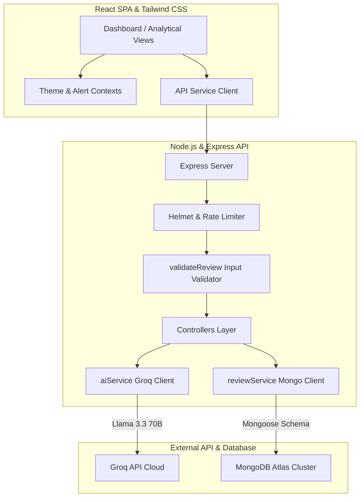
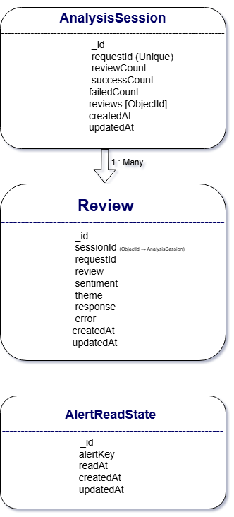
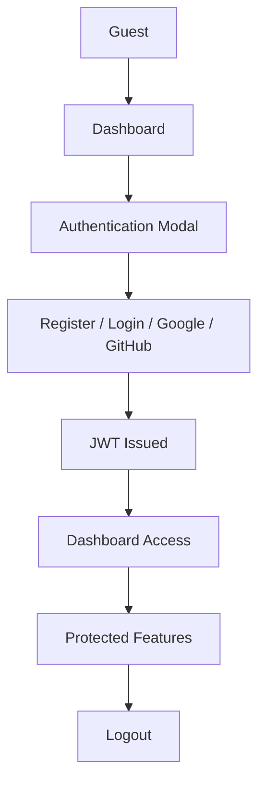
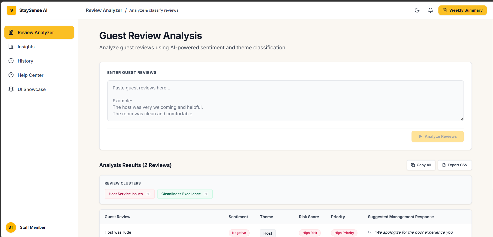
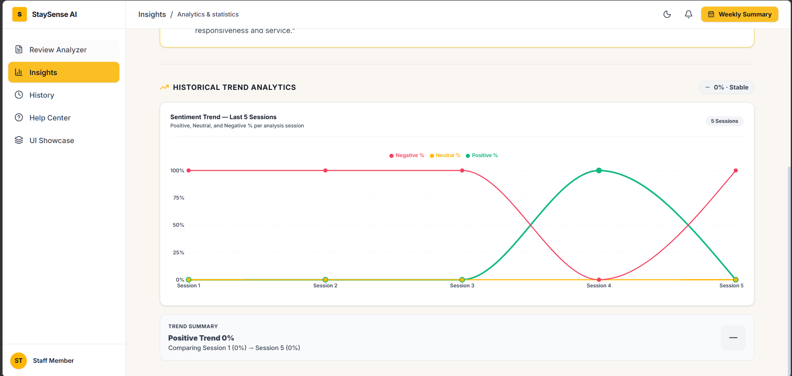
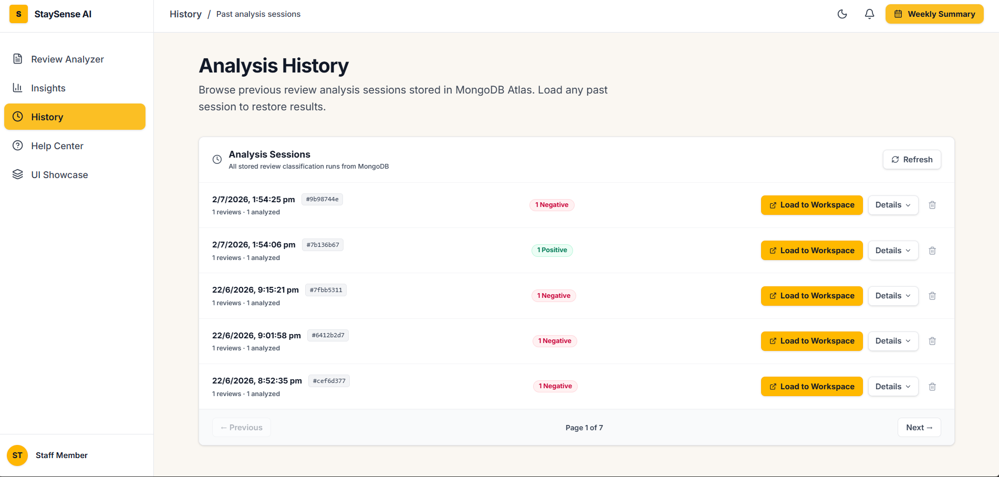

# StaySense AI

[](https://nodejs.org/)
[](https://react.dev/)
[](https://vite.dev/)
[](https://expressjs.com/)
[](https://www.mongodb.com/atlas)
[](https://jwt.io/)
[](https://www.passportjs.org/)
[](https://tailwindcss.com/)
[](https://groq.com/)
[](./LICENSE)

StaySense AI is an enterprise-grade, production-ready **Guest Review Intelligence Dashboard** custom-engineered for hospitality businesses. Harnessing the raw inference speed and deep analytical capabilities of the Groq API (powered by **Llama 3.3 70B**), StaySense AI automates the parsing, sentiment classification, theme isolation, and response formulation for guest feedback. All records are persisted to MongoDB Atlas, enabling trends analysis, weekly summaries, data-driven hygiene/operational alerts, and historical performance tracking.

---

## 🚀 Key Features

*   **🤖 AI-Powered Review Analysis:** Implements advanced NLP pipelines executing zero-shot classification and contextual analysis on single or bulk review datasets.
*   **📊 Sentiment Classification:** Automatically categorizes guest sentiment into `Positive`, `Neutral`, or `Negative` with high precision.
*   **🏷️ Theme Detection:** Isolates specific business dimensions touched by the guest, classifying reviews into core operational themes:
    *   `Food`, `Host`, `Location`, `Cleanliness`, `Value`, `Experience`
*   **✍️ AI Response Suggestions:** Auto-generates polite, professional, and contextually-aware draft replies tailored specifically to the sentiment and theme of the guest's review.
*   **💾 Historical Review Storage:** Retains every classified review and historical batch session in MongoDB Atlas for longitudinal reporting.
*   **📅 Weekly Management Summaries:** Aggregates operational metrics, review counts, average sentiment distribution, and primary customer complaints weekly.
*   **📈 Historical Trend Visualizations:** Real-time interactive charts illustrating daily feedback volume, historical sentiment shifts, and theme distributions.
*   **🚨 Data-Driven AI Alerts:** Analyzes historical records to raise automated business warnings (e.g., hygiene alerts for cleanliness issues, service deterioration alerts, or host-related complaints).
*   **🔔 Live Notification System:** Modern interactive toast notifications and alert read/unread states persisted to the database.
*   **🌓 Dark/Light Theme Support:** Fully styled CSS dark and light modes leveraging standard React Context API state variables.
*   **📤 CSV Export Utility:** One-click utility for hospitality managers to download tabular review data for external reporting or auditing.
*   **🔑 JWT Authentication:** Secure user registration, authentication token management, and session isolation.
*   **🌐 Google OAuth:** "Continue with Google" integration for seamless account creation and login.
*   **🖥️ GitHub OAuth:** "Continue with GitHub" support, providing flexible developer-friendly sign-in options.
*   **👤 User-Specific Dashboards:** Custom-tailored experience isolating review histories, weekly summaries, AI insights, and alerts by user.
*   **🛡️ Protected Routes & Route Guards:** Multi-layered security ensuring frontend and backend route restrictions prevent unauthorized access.
*   **🔒 Secure Authentication:** Hashed passwords via bcrypt and strict endpoint security policies.
*   **🏢 Multi-User Architecture:** Comprehensive database and session isolation ensuring absolute user data privacy.

---

## 🏛️ Project Architecture



### Component Details
*   **Frontend Client:** Built using **React + Vite**, utilizing modern component layout structures, Framer Motion for high-fidelity interactive micro-animations, and Recharts for data rendering.
*   **Rate Limiter & Security Headers:** Express endpoints are protected using `helmet` for HTTP response header decoration and `express-rate-limit` to prevent denial-of-service attempts.
*   **Input Validation Layer:** The `validateReviewInput` middleware enforces size boundaries, string checks, and min-character validation prior to submitting payloads to Groq.
*   **AI Engine (Groq SDK):** Processes reviews asynchronously, running batch pipelines using concurrency controls.
*   **Persistence Layer:** MongoDB database managed through Mongoose models (`AnalysisSession`, `Review`, `AlertReadState`), tracking dynamic metrics and read/unread alert states.

---

## 🗄 Database

StaySense AI leverages **MongoDB Atlas** as its cloud database provider, integrated seamlessly with the backend services using **Mongoose** ODM.

### Why MongoDB was Chosen:
*   **Flexible Document Model:** Allows stored review structures, AI responses, and alert structures to evolve without complex migration cycles.
*   **AI-Generated Review Storage:** Persists nested array elements and complex key-value pairs (sentiment, scores, responses) naturally in a JSON-like format.
*   **Historical Analytics:** Efficiently aggregates analytical summaries, trend logs, and alert states across large datasets.
*   **Scalability:** Horizontal scaling and dynamic clustering capabilities of MongoDB Atlas support high-throughput review batches.
*   **Easy Express Integration:** Mongoose schemas map perfectly to Express controllers, enabling developer productivity and clean data modeling.

---

## 🗂 Database Schema



The schema diagram represents the MongoDB collections and their relationships:
*   `AnalysisSession`: Groups reviews from a single batch analysis request. Each session is identified by a unique `requestId` UUID and tracks summary metrics (`reviewCount`, `successCount`, `failedCount`).
*   `Review`: Stores individual guest reviews along with the AI classifications (`sentiment`, `theme`), the AI-generated `response` suggestions, and references to its parent `AnalysisSession` (`sessionId`).
*   `AlertReadState`: Tracks the read/unread state of system alerts generated from analyzing historical review logs.

---

## 📁 Folder Structure

### Backend Layout
```
backend/
├── docs/
│   └── postman_collection.json    # Pre-configured API collection
├── src/
│   ├── config/
│   │   ├── database.js            # MongoDB Mongoose connection handler
│   │   └── index.js               # Consolidated server environment variables
│   ├── controllers/
│   │   ├── historyController.js   # History, weekly summaries, alerts, & trends
│   │   └── reviewController.js    # AI processing & review analysis orchestration
│   ├── middleware/
│   │   ├── errorHandler.js        # Global HTTP AppError interceptor
│   │   ├── requestLogger.js       # Incoming request logger
│   │   └── validateReview.js      # Input payload validation logic
│   ├── models/
│   │   ├── AlertReadState.js      # PERSISTED alert read state mapping
│   │   ├── AnalysisSession.js     # Top-level review request session Schema
│   │   └── Review.js              # Classified Review Schema (Sentiment, Theme, Response)
│   ├── prompts/                   # System instructions for LLM structuring
│   ├── routes/
│   │   ├── historyRoutes.js       # /api/history routes configuration
│   │   └── reviewRoutes.js        # /api/reviews routes configuration
│   ├── services/
│   │   ├── aiService.js           # Groq SDK / Llama 3.3 prompt execution
│   │   └── reviewService.js       # Mongoose queries, aggregations, & trends
│   ├── utils/
│   │   ├── AppError.js            # Extensible Operational Error Class
│   │   └── logger.js              # Console logging output wrapper
│   └── app.js                     # Express app bootstrap & middleware registrations
├── .env.example                   # Backend environment template
├── package.json                   # Backend dependencies and scripts
└── server.js                      # Application main entry point
```

### Frontend Layout
```
frontend/
├── public/                        # Public assets and favicon
├── src/
│   ├── assets/                    # Shared image assets & CSS files
│   ├── components/
│   │   └── ui/
│   │       ├── Button.jsx         # Custom interactive buttons
│   │       ├── Input.jsx          # Reusable Form Input components
│   │       ├── Loader.jsx         # Modern UI spinner
│   │       ├── Modal.jsx          # Accessible Overlay Component
│   │       ├── Toast.jsx          # Floating operational notifications
│   │       └── index.js           # Component export module
│   ├── context/
│   │   └── ThemeContext.jsx       # Global Dark/Light mode state context
│   ├── layouts/
│   │   └── DashboardLayout.jsx    # Persistent Side-Navigation Layout
│   ├── pages/
│   │   ├── Auth.jsx               # Mock Authentication screen
│   │   ├── Help.jsx               # UI documentation & FAQs
│   │   ├── History.jsx            # Historical sessions explorer & deletion
│   │   ├── Insights.jsx           # Analytics charts, metrics, & Weekly Summary
│   │   ├── ReviewAnalyzer.jsx     # AI review submit console & CSV exporter
│   │   └── Showcase.jsx           # UI component preview arena
│   ├── services/
│   │   ├── api.js                 # Network Fetch client methods
│   │   └── helpers.js             # Date/string formatting utilities
│   ├── App.css                    # Route-level transitions styles
│   ├── App.jsx                    # Routing & global providers setup
│   ├── index.css                  # Tailored Tailwind CSS style system
│   └── main.jsx                   # React application DOM mounting file
├── .env.example                   # Frontend environment template
├── index.html                     # HTML root template file
├── package.json                   # Frontend dependencies and scripts
└── vite.config.js                 # Vite bundler parameters configuration
```

---

## 🔄 API Flow Diagram

The sequence below illustrates the life cycle of a guest review analysis request:

```
[ Frontend Dashboard ]
        │
        │ 1. POST /api/reviews/analyze (reviews array)
        ▼
[ Express Router ]
        │
        │ 2. Validates review formats (validateReviewInput)
        ▼
[ reviewController ]
        │
        │ 3. Instantiates UUID (requestId)
        ▼
[ aiService (Groq Client) ] ◄───► [ Groq Cloud (Llama 3.3 70B) ]
        │                                 (Sentiment, Theme, Response generation)
        │ 4. Receives AI Classifications
        ▼
[ reviewService (Mongoose) ] ───► [ MongoDB Atlas ]
        │                                 (Persists AnalysisSession & Reviews)
        │ 5. Returns saved models
        ▼
[ Frontend Dashboard ]
        │ (Displays categorized list, dynamic alerts, and response drafts)
```

---

## 🔌 API Reference

### Root Endpoint
*   **`GET /`**  
    Returns service description, status, and active API endpoints.
    *   **Response (200 OK):**
        ```json
        {
          "success": true,
          "service": "Homestay Review Sentiment Classifier",
          "version": "1.0.0",
          "endpoints": {
            "analyze": "POST   /api/reviews/analyze",
            "health": "GET    /api/reviews/health",
            "history": "GET    /api/history",
            "session": "GET    /api/history/:requestId",
            "stats": "GET    /api/history/stats/summary",
            "deleteSession": "DELETE /api/history/:requestId"
          }
        }
        ```

### Review Operations

*   **`POST /api/reviews/analyze`**  
    Submits one or more guest reviews for classification.
    *   **Payload formats:**
        1. Single review:
           ```json
           { "review": "The host was extremely friendly and helpful. Made us feel right at home." }
           ```
        2. Array batch:
           ```json
           { "reviews": ["Review text 1", "Review text 2"] }
           ```
        3. Newline-separated batch:
           ```json
           { "reviews": "Review line 1\nReview line 2" }
           ```
    *   **Response (200 OK):**
        ```json
        {
          "success": true,
          "requestId": "a1b2c3d4-e5f6-7890-abcd-ef1234567890",
          "count": 1,
          "data": [
            {
              "review": "The host was extremely friendly and helpful. Made us feel right at home.",
              "sentiment": "Positive",
              "theme": "Host",
              "response": "Thank you for your kind words about our host — we look forward to welcoming you again.",
              "error": null
            }
          ]
        }
        ```

*   **`GET /api/reviews/health`**  
    Simple availability status endpoint.
    *   **Response (200 OK):**
        ```json
        {
          "success": true,
          "status": "healthy",
          "timestamp": "2026-06-26T16:18:00.000Z"
        }
        ```

### History & Insights Layer

*   **`GET /api/history`**  
    Returns a paginated list of all past analysis sessions.
    *   **Query Parameters:** `page` (default `1`), `limit` (default `20`).
    *   **Response (200 OK):**
        ```json
        {
          "success": true,
          "sessions": [
            {
              "_id": "603d2e1b...",
              "requestId": "a1b2c3d4-e5f6-7890-abcd-ef1234567890",
              "reviewCount": 1,
              "successCount": 1,
              "failedCount": 0,
              "createdAt": "2026-06-26T16:18:00.000Z"
            }
          ],
          "total": 1,
          "page": 1,
          "totalPages": 1
        }
        ```

*   **`GET /api/history/stats/summary`**  
    Aggregates metrics across the entire review collection (average sentiment percentages, theme volumes, response counts).
    *   **Response (200 OK):**
        ```json
        {
          "success": true,
          "data": {
            "totalReviews": 150,
            "sentimentCounts": { "Positive": 100, "Neutral": 30, "Negative": 20 },
            "themeCounts": { "Cleanliness": 45, "Host": 55, "Food": 15, "Location": 15, "Value": 10, "Experience": 10 }
          }
        }
        ```

*   **`GET /api/history/alerts`**  
    Scans reviews to identify operational anomalies or recurring issue patterns, emitting structured alerts.
    *   **Response (200 OK):**
        ```json
        {
          "success": true,
          "data": [
            {
              "id": "alert_hygiene_concerns_2026-06-26",
              "title": "Hygiene Concerns Detected",
              "message": "Multiple guest complaints regarding cleanliness were reported recently.",
              "severity": "high",
              "category": "Cleanliness",
              "read": false
            }
          ]
        }
        ```

*   **`POST /api/history/alerts/read`**  
    Marks specific generated alerts as read.
    *   **Body:** `{ "alertIds": ["alert_hygiene_concerns_2026-06-26"] }`
    *   **Response (200 OK):**
        ```json
        {
          "success": true,
          "message": "Marked 1 alert(s) as read"
        }
        ```

*   **`GET /api/history/weekly-summary`**  
    Compiles summary reports for the previous 7 days.
    *   **Response (200 OK):**
        ```json
        {
          "success": true,
          "data": {
            "totalThisWeek": 28,
            "positivePercentage": 82,
            "topTheme": "Host",
            "actionNeededCount": 3
          }
        }
        ```

*   **`GET /api/history/trends`**  
    Yields historical data arrays optimized for recharts rendering.
    *   **Response (200 OK):**
        ```json
        {
          "success": true,
          "data": [
            { "date": "2026-06-20", "Positive": 5, "Neutral": 1, "Negative": 0 },
            { "date": "2026-06-21", "Positive": 7, "Neutral": 0, "Negative": 1 }
          ]
        }
        ```

*   **`GET /api/history/:requestId`**  
    Retrieves full details of a specific session, including nested reviews.
    *   **Response (200 OK):**
        ```json
        {
          "success": true,
          "data": {
            "_id": "603d2e1b...",
            "requestId": "a1b2c3d4-e5f6-7890-abcd-ef1234567890",
            "reviews": [
              {
                "review": "The host was extremely friendly...",
                "sentiment": "Positive",
                "theme": "Host",
                "response": "Thank you for your kind words..."
              }
            ]
          }
        }
        ```

*   **`DELETE /api/history/:requestId`**  
    Deletes the session record and cascades deletions to all associated review documents.
    *   **Response (200 OK):**
        ```json
        {
          "success": true,
          "message": "Session deleted successfully",
          "deletedSessionCount": 1,
          "deletedReviewsCount": 1
        }
        ```

---

## 🚦 HTTP Status Codes

The application employs consistent HTTP response codes to communicate endpoint execution:

| Code | Status | Application Usage |
| :--- | :--- | :--- |
| `200` | **OK** | Success response containing requested payloads, summaries, or deletion status. |
| `400` | **Bad Request** | Missing body, validation error (e.g. `REVIEW_TOO_SHORT`, `INVALID_INPUT`, `BATCH_TOO_LARGE`). |
| `404` | **Not Found** | Route path is invalid, or the specified `requestId` session is absent. |
| `500` | **Internal Server Error** | Unexpected program bug, database query failure, or unhandled exceptions. |
| `503` | **Service Unavailable** | MongoDB cluster connection failure or database unavailable. |

---

## 🛡️ Error Handling Strategy

StaySense AI uses a centralized error management stack.

1.  **Operational vs. Programming Errors:** Expected anomalies (invalid bodies, offline DB, missing records) are wrapped inside a custom `AppError` class inheriting from JS `Error`. Operational errors are flagged with `isOperational = true` to prevent server restarts.
2.  **Central Global Middleware:** Registered as the last handler in `app.js`. It catches synchronous and asynchronous controller errors, logs details using `logger`, and returns standard payloads to client interfaces:
    ```json
    {
      "success": false,
      "error": {
        "code": "DB_UNAVAILABLE",
        "message": "Database is not connected"
      }
    }
    ```
3.  **Client-Side Resilience:** The React client (in `frontend/src/services/api.js`) handles timeouts, API failure responses, and network loss. It extracts the error codes to present descriptive troubleshooting hints on the UI.

---

## ⚙️ Installation & Setup

### Prerequisites
*   Node.js (v18.0.0 or higher)
*   NPM (v9.0.0 or higher)
*   MongoDB Atlas Account or local MongoDB Community Server

### 1. Clone & Core Setup
```bash
git clone https://github.com/Tanya0301-oss/staysense-ai.git
cd staysense-ai
```

### 2. Backend Setup
1.  Navigate to the backend directory:
    ```bash
    cd backend
    ```
2.  Install dependencies:
    ```bash
    npm install
    ```
3.  Create your environment configuration:
    ```bash
    cp .env.example .env
    ```
4.  Configure `.env` using the credentials in the [Environment Variables](#-environment-variables) section below.
5.  Launch development server with automatic refresh:
    ```bash
    npm run dev
    ```
    *The API will start listening on port `3000` (or the PORT specified).*

### 3. Frontend Setup
1.  Navigate to the frontend directory:
    ```bash
    cd ../frontend
    ```
2.  Install dependencies:
    ```bash
    npm install
    ```
3.  Create your environment configuration:
    ```bash
    cp .env.example .env
    ```
4.  Configure `VITE_API_URL` to point to your backend (default is `http://localhost:3000`).
5.  Launch Vite development server:
    ```bash
    npm run dev
    ```
    *Open the URL printed in terminal (default `http://localhost:5173`) in your web browser.*

### Environment Variables
Sensitive configuration credentials and API keys are not committed to Git source control. The project relies on `.env` files located in the `backend/` and `frontend/` folders. You can use the provided `.env.example` files in each directory as a reference configuration template:
*   For the backend, configure `backend/.env` based on [backend/.env.example](file:///d:/homestay/backend/.env.example).
*   For the frontend, configure `frontend/.env` based on [frontend/.env.example](file:///d:/homestay/frontend/.env.example).

---

## 🔑 Environment Variables

To protect credentials, environment values must be populated in the local `.env` files. **Never commit `.env` files directly to Git source control.**

### Backend (`backend/.env`)
```properties
# ── Groq API Configuration ──────────────────────────
GROQ_API_KEY=your_groq_api_key_here
GROQ_MODEL=llama-3.3-70b-versatile

# ── Server Configuration ─────────────────────────────
PORT=3000
NODE_ENV=development

# ── Rate Limiting Configuration ──────────────────────
RATE_LIMIT_WINDOW_MS=60000
RATE_LIMIT_MAX_REQUESTS=30

# ── Batch Processing Configuration ───────────────────
MAX_REVIEWS_PER_REQUEST=50
LLM_CONCURRENCY=5
LLM_TIMEOUT_MS=30000

# ── MongoDB Atlas Configuration ──────────────────────
MONGODB_URI=mongodb+srv://<username>:<password>@cluster.mongodb.net/staysense

# ── SaaS Authentication & Security ───────────────────
# Secret used to sign JSON Web Tokens (JWT)
JWT_SECRET=your_jwt_secret_hex_here
# JWT expiration duration
JWT_EXPIRES_IN=7d
# CORS allowed origin
CORS_ORIGIN=http://localhost:5173
```

### Frontend (`frontend/.env`)
```properties
# Backend API Base URL
VITE_API_URL=http://localhost:3000
```

---

## 🔒 SaaS Multi-User Authentication & Security

StaySense AI has been upgraded into a secure, multi-user SaaS dashboard with absolute data isolation between users.

### Security Architecture

*   **HTTP-Only Secure Cookies:** JWT tokens are stored exclusively in HTTP-only cookies (`token`), protecting them against Cross-Site Scripting (XSS) attacks. No tokens are saved in `localStorage` or `sessionStorage`.
*   **Data Isolation:** All database collections are linked to the authenticated user via their `User` model `ObjectId` ref. Every service query filters records matching the active user (`req.user._id`), preventing horizontal privilege escalation.
*   **MongoDB Sanitization:** Integrated `express-mongo-sanitize` to strip prohibited characters (like `$` or `.`) to neutralize NoSQL injection vulnerabilities.
*   **Helmet Headers:** Enforces security policies (CSP, XSS protection, HSTS, iframe embedding protection) through standard Helmet header configurations.
*   **Brute-Force Protection:** Stricter rate-limiting thresholds applied to the login endpoint (`/api/auth/login`) limiting requests to 10 attempts per 15 minutes.
*   **Generic Error Messages:** Auth errors do not disclose if the target email is registered or if the password alone was wrong, mitigating user enumeration attacks.

### Authentication Flow

1.  **Browser Access:** Page loads and React's `AuthContext` calls `GET /api/auth/me` with `credentials: 'include'`.
2.  **Verification:** The `protect` middleware reads the cookie, verifies the signed JWT via `jsonwebtoken`, selects the user (excluding password), and attaches the user document to `req.user`.
3.  **Authentication Success:** `App.jsx` receives the verified user profile, automatically switches layout, and renders the Dashboard and analytical features.
4.  **Redirecting Unauthenticated Users:** If verification fails (401), the loading state finishes and immediately redirects the browser to the secure login page.

### Admin Provisioning & Data Migration

Since this dashboard is an internal business tool, there is **no public registration page**. Admin or Manager users must be provisioned securely.

1.  **Seed Default Admin User:** Run the bootstrap script to create the first admin:
    ```bash
    node src/scripts/seedAdmin.js
    ```
    *Creates user `admin@staysense.ai` with password `Admin@StaySense1`. Configure custom settings by setting `ADMIN_NAME`, `ADMIN_EMAIL`, and `ADMIN_PASSWORD` in `backend/.env` prior to running.*
2.  **Migrate Existing MongoDB Records:** For existing MongoDB collections, align all historical sessions with the newly created admin account by running:
    ```bash
    node src/scripts/migrateSessionsToUser.js
    ```
    *Finds any orphaned `AnalysisSession` records with no `user` field and assigns them to the first Admin user.*


---

## Authentication Features

*   **✅ User Registration:**
    *   Register with Full Name, Email, and Password.
    *   Passwords are automatically hashed using `bcrypt` (10–12 salt rounds) before database storage.
    *   Duplicate email protection checks prevent multiple accounts using the same email address.
*   **✅ User Login:**
    *   Secure authentication using credentials (email and password).
    *   Issues JSON Web Tokens (JWT) for secure authentication.
    *   Complete authentication token management and lifecycle validation.
*   **✅ Logout:**
    *   Secure logout functionality to clear user session.
    *   Server and client-side session termination.
*   **✅ Google OAuth Login:**
    *   Provides "Continue with Google" access.
    *   Automatically provisions and registers accounts for new users.
    *   Existing users are logged in seamlessly without redundant authentication prompts.
*   **✅ GitHub OAuth Login:**
    *   Provides "Continue with GitHub" access.
    *   Seamless automated onboarding for new users and instant access for registered accounts.
*   **✅ Protected API Routes:**
    *   Protected by a dedicated JWT verification middleware.
    *   Unauthorized actions, missing tokens, or malformed JWTs return `HTTP 401 Unauthorized` responses.
*   **✅ Protected Frontend Routes:**
    *   Enforces authenticated-only routing for core workspace dashboards.
    *   Guests and unauthenticated visitors are automatically redirected to the login page or authentication modal.
*   **✅ User-Specific Dashboard:**
    *   Each authenticated user has access *only* to their own isolated environment containing:
        *   Personal review history
        *   Personal analysis sessions
        *   Personal AI insights
        *   Personal alerts
        *   Personal weekly summary
        *   Personal dashboard data
    *   Absolute data isolation ensures that no user can view, access, or modify another user's records.

---

## Security Features

StaySense AI implements an enterprise-grade security model to guarantee data integrity, privacy, and protection against common vulnerability vectors:

*   **bcrypt Password Hashing:** User passwords are encrypted prior to database insertion using the standard `bcrypt` algorithm with `10–12` salt rounds, protecting credentials against brute-force decrypt attempts.
*   **JWT Authentication:** Employs stateless JSON Web Tokens signed with a strong backend secret (`JWT_SECRET`) to maintain verified client-server sessions.
*   **Protected API Routes:** Middleware validation intercepts requests to private backend controllers, rejecting any calls lacking a valid Bearer token.
*   **Route Guards:** Frontend wrapper components restrict dashboard visibility, ensuring the UI remains secure and isolated.
*   **OAuth Authentication:** Delegates credentials authentication options to industry-standard providers (Google & GitHub Passport.js strategies), eliminating the need to store passwords directly for social login accounts.
*   **MongoDB User Isolation:** Every query explicitly filters on the authenticated user's unique identifier (`req.user._id`), guaranteeing absolute database-level multi-tenant isolation.
*   **Environment Variable Protection:** Strictly manages passwords, credentials, tokens, and APIs using non-committed `.env` configurations.
*   **Secure Authentication Flow:** Incorporates structured token issuance, secure cookies or header-based verification, and graceful session cleanup during logout.
*   **Input Validation:** The backend schema enforces strict parameters on reviews, email patterns, and input length, preventing cross-site scripting (XSS) and NoSQL inject attempts.
*   **Rate Limiting on Authentication Endpoints:** Restricts requests to register/login paths to mitigate credential stuffing and automated denial-of-service attempts.

---

## Authentication API

All authentication endpoints are documented below. Protected endpoints require the client to supply the signed JWT inside the `Authorization` header.

| Method | Endpoint | Description | Auth Required |
| :--- | :--- | :--- | :--- |
| `POST` | `/api/auth/register` | Registers a new user account with Name, Email, and Password. | No |
| `POST` | `/api/auth/login` | Validates credentials and returns a secure JWT. | No |
| `POST` | `/api/auth/logout` | Terminates session, invalidates/clears auth states. | Yes |
| `GET` | `/api/auth/google` | Initiates the Google OAuth login flow. | No |
| `GET` | `/api/auth/google/callback` | Callback URL handled by passport for Google authentication. | No |
| `GET` | `/api/auth/github` | Initiates the GitHub OAuth login flow. | No |
| `GET` | `/api/auth/github/callback` | Callback URL handled by passport for GitHub authentication. | No |

> [!IMPORTANT]
> Protected endpoints require a valid JSON Web Token in the header:
> ```http
> Authorization: Bearer <JWT>
> ```

---

## Authentication Flow

The diagram below maps the interaction cycle for guest registration, login, token issuance, and resource authorization:



---

## Week 6 Deliverables Completed

- [x] Register implemented
- [x] Login implemented
- [x] Logout implemented
- [x] JWT Protected APIs
- [x] Protected Frontend Routes
- [x] Google OAuth
- [x] GitHub OAuth
- [x] Rate Limiting
- [x] Input Validation
- [x] bcrypt Password Hashing

---

## 📸 Application Screenshots

### Dashboard

A real-time insights dashboard visualizing key metrics, weekly summaries, active guest alerts, and sentiment trends.

### Review Analyzer

The AI review submit console for submitting guest reviews (individually or in bulk) to perform zero-shot sentiment classification, theme detection, and suggestions response generation.

### History

The historical reviews log allowing administrators and managers to view past analysis sessions, filter results, and delete logs.
---

## 🔮 Future Enhancements

*   **🏢 Multi-Property Operations:** Extend Mongoose schemas to support multi-property separation, allowing managers to monitor multiple hotels, homestays, or rentals from a single centralized console.
*   **🔌 Property Management System (PMS) Integrations:** Seamlessly hook into APIs of popular PMS suites (e.g. Cloudbeds, Guesty, Opera) to fetch guest reviews automatically on checkout.
*   **📧 Automated Email Dispatch:** Auto-send generated responses directly to booking channels or guest correspondence systems upon review approval.
*   **🗣️ Multi-Lingual Classification:** Enable native translation layers to analyze reviews written in Spanish, French, German, Japanese, and Mandarin, providing English translation drafts alongside original response suggestions.
*   **📈 Custom Fine-Tuning:** Integration pipelines to configure model prompts dynamically, ensuring the tone of AI-suggested responses matches individual property brand guidelines.

---

## 📄 License

This software is released under the terms of the [MIT License](file:///d:/homestay/LICENSE).  
Copyright © 2026 Tanya Maheshwari. All rights reserved.
